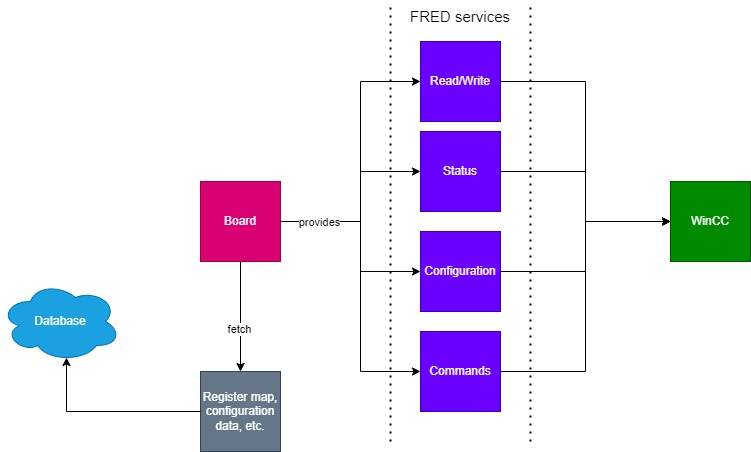

# FIT FRED
## About
This repository contains the FRED MAPI code for ALICE's FIT detector.

## Build & Run
Required - `devtoolset-7`.
```
git submodule update --init
cd core
cmake3 . -DMAPI=1
make
cd ..
bin/FREDServer
```

## General concept

The FIT FRED implementation utilizes a board-based command layout and emphasizes the role of an electronic board as the fundamental unit of the system. Each board is represented by an object that holds its register map and the most recent values. All read and write operations are performed through the board object, which provides essential information about the register layout and validates requests to ensure they meet value constraints. All information about the boards is fetched from the database, which provides high flexibility.



## Documentation

### Services

- [Parameters](docs/services/PARAMETERS.md)
- [Board status](docs/services/BOARD_STATUS.md)
- [Configurations](docs/services/CONFIGURATIONS.md)
- [Reset system](docs/services/RESET_SYSTEM.md)
- [Reset errors](docs/services/RESET_ERRORS.md)
- [Reset](docs/services/RESET.md)

### Others

- [Database](docs/others/Database.md)
- [WinCC message format](docs/others/ReadWriteWinCC.md)