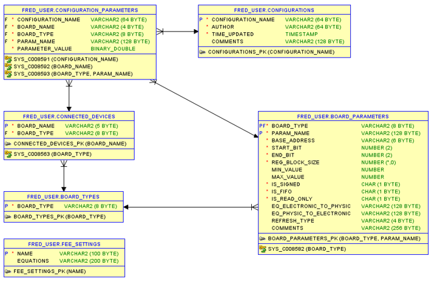

## Database structure

 - **BOARD_PARAMETERS** - stores memory layout of PM and TCM as a list of parameters, each parameter is a bit-field,register or block of registers

 - **BOARD_TYPE** - stores board types (PM,TCM)

 - **CONNECTED_DEVICES** - stores information about boards that are expected to be available

 - **CONFIGURATIONS** - stores configurations name along with their author and the date of last update

 - **CONFIGURATION_PARAMETERS** - stores configurations data 

 - **FEE_SETTINGS** - stores definition of variables required to configure FRED for the subdetector (discussed in further sections)

 


## Parameters

Each parameter may represent a bit-field, a register, or a block of registers (currently, operations on register blocks are not supported within FIT FRED). A parameter is identified by a combination of board type (PM/TCM) and name. In addition to the parameter's address and bit position, the table stores the following information:

- Minimum and maximum values stored in the electronic format.
- Whether the parameter is signed, a FIFO, or read-only.
- Refresh type: if set to SYNC, the parameter is checked every second.
- Equations for converting physical values to electronic values and vice versa.
- Register block size: the size of a register block or the length of the FIFO

Equations are constraint to operators supported by the internal FRED calculator, the list of the operators is provided below.
```
        OPERATOR_TERNARY_S,      /// :
        OPERATOR_TERNARY_Q,      /// ?
        OPERATOR_BITWISE_OR,     /// |
        OPERATOR_BITWISE_XOR,    /// ^
        OPERATOR_BITWISE_AND,    /// &
        OPERATOR_EQUAL,          /// =
        OPERATOR_LESS,           /// <
        OPERATOR_LESS_EQUAL,     /// <=
        OPERATOR_GREATER,        /// >
        OPERATOR_GREATER_EQUAL,  /// >=
        OPERATOR_BITWISE_SHL,    /// <<
        OPERATOR_BITWISE_SHR,    /// >>
        OPERATOR_ADDITION,       /// +
        OPERATOR_SUBTRACTION,    /// -
        OPERATOR_MULTIPLICATION, /// *
        OPERATOR_DIVISION,       /// /
        OPERATOR_MODULO,         /// %
        OPERATOR_POWER,          /// **
        OPERATOR_EXPONENT        /// e, E
```

Moreover, the equation should be constructed based on two rules. First, the variable in the equation should be either the name of the parameter to convert, another parameter from the given board or the TCM board, or the name of an environment variable (from the FEE settings table). The variable should be enclosed in `{}` brackets.

Example 1:
```
{PMC8_LINE_0_DELAY}*({TDC}*6.0)
```

Second, the numerator and denominator should always be enclosed within `()` brackets.

Example 2:
```
({LASER_DELAY}*2048)/({BC_INTERVAL})
```

It is also vital to keep in mind that FRED supports only fixed-point calculations. Input variables are truncated to the third decimal position. The result is not truncated.